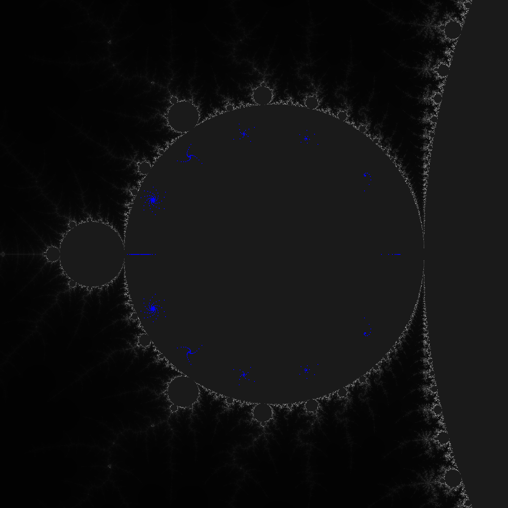
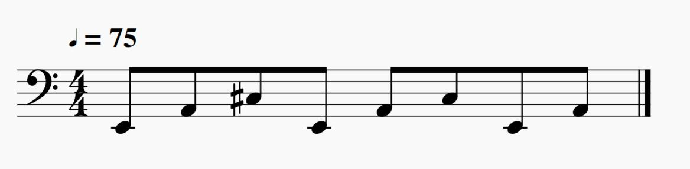
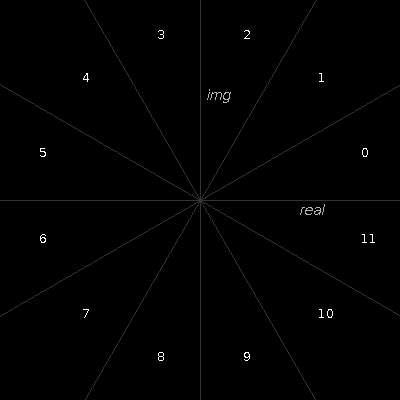

# complex-music


## Overview
The complex-music project is a library for generating music in Kotlin.  Specifically, it contains routines to 
generate the musical material in the paper -[./docs/complex-music.pdf](./docs/complex-music.pdf), which presents a
method to generate music from the Mandelbrot set.

Musical material in this library is primarily represented as a series of integers, which provides rich functionality and
can be naturally mapped to other representations. For example, integer pitches can be interpreted as intervals that are
transposed to a root scale pitch and applied to other series of material. This approach offers a powerful and flexible
way to generate music in various styles, and even create new styles.

The library demonstrates a method to map sets of complex numbers to series of integers and generate music based 
on that material.

This version of the library is curated and focused on the specific music generation approach described in the paper. It
is not intended to be an exhaustive music generation library, although it may have utility in multiple contexts.
Additionally, it includes a number of musical utilities such as MIDI playback and MIDI file generation.

## Usage
The code utilizes standard Kotlin features and is designed to integrate easily with other Kotlin code in a
convenient and idiomatic way.  See the examples below for usage.

## Integers

### Language Features
This library adopts an integer-based representation as the primary means of representing musical material. 
This approach offers significant power and flexibility, enabling the generation of music across various contexts. 
Additionally, this integer-based representation naturally maps to other common representations, such as MIDI 
or other native formats.

In fact, leveraging the built-in functional capabilities of Kotlin alone is adequate for generating musical material 
with great elegance. The following example primarily focuses on the pitch dimension, but the underlying principles 
can be applied to other dimensions as well.
```kotlin
val pitches = listOf(60, 62, 64, 65, 67, 69, 71, 72) // midi pitches for C major scale
val transposed = pitches.map { it + 2 }              // adds 2 to each midi pitch, transposing to D major scale
val reversed = transposed.reversed()                 // retrograde of D major scale
val phrase = pitches.zip(reversed)                   // interleaves the two pitches
println(phrase)                                      // prints the pitches
phrase.map { /* map to specific midi player */ }     // map to a specific implementation  
```

### Library Features
This library provides capabilities above and beyond the language features.
Most of the library operations utilize the `Iterable` interface, which is foundational to collections such as `List`, 
`Set`, etc. This permits seamless integration between the library’s functions and external code, permitting interaction 
with diverse data types regardless of whether they are standard or user-defined, or serving as input or output.
For example:
```kotlin
val pitches = listOf(60, 62, 64, 65, 67, 69, 71, 72)  // midi pitches for C major scale
val transposed = pitches.transpose(2)                 // transposes to D major scale
val steps = 0 until 14                                // a range of scale steps
val phrase = pitches.step(steps)                      // 2 repetitions of the C major scale
```

### Abstract Pitch Representation: Pitch Classes

Pitch classes provide an abstract form of expressing pitch. A pitch class is a number that ranges from 0 to 11, where
the value cycles back to 0 after reaching 11. This concept was first introduced by Allen Forte in the 1970s in his
book "The Structure of Atonal Music". The pitch class disregards the octave and even the root pitch, implying that
any major scale, for instance, will have an identical pitch class representation. Here's how the C and D major scales
would look in the context of pitch classes:

```kotlin
val major = listOf(0, 2, 4, 5, 7, 9, 11, 12)   // major scale in pitch classes
val cMajor = major.transpose(60)               // C major scale (at midi pitch 60)
val dMajor = major.transpose(62)               // D major scale (at midi pitch 62)
val dMajor2 = cMajor.transpose(2)              // D major scale (at midi pitch 62)
```

### Wrapping

The `wrapped` function applies an index to a series of integers, supporting both positive and negative wrapping.

The optional `octave` parameter (default: true) adjusts the octave when wrapping occurs. It moves the octave up or down as
needed, ensuring that a wrapped scale remains within the proper pitches. This allows the scale to traverse the keyboard
in a musical way, even when wrapping beyond the beginning or end.

Note: For durations or other material, a similar wrapping can be applied, but the `octave` parameter is usually set to
false.

The code below provides a simple example. The first line creates a scale with 5 pitches, and the second line indexes the
scale to retrieve element 0, which corresponds to the root pitch 50. The next line indexes element 2, resulting in 54.
The third line indexes element 5, which exceeds the defined scale collection's length, causing it to wrap back to the
beginning at 50. (If the octave parameter were true, the octave would be incremented by 12, resulting in 62. This pitch
is identical to 50 but one octave higher and represents the next pitch when playing the scale up the keyboard.)

```kotlin
val pitches = listOf(0, 2, 4, 7, 11).transpose(50)  // a scale, chord, or other series of pitches
println(pitches.wrapped(0, false))        // octave parameter is false
println(pitches.wrapped(2, false))
println(pitches.wrapped(5, false))
```

### Skip Steps
The `skipStep` function extracts a series of _relative_ steps from any series of source material.

One potential use is to define consecutive movements along a scale to create a melody, where each skip
represents the number of steps to be skipped. This approach supports both positive and negative indexing.

In the code example below, we utilize the initial pitch and progressively move up by 1 step each time, 
wrapping around to the first pitch if necessary.

```kotlin
val pitches1 = listOf(50, 52, 54, 57)       // some scale, chord, or other series of pitches
val skips1 = listOf(0, 1, 1, 1, 1)          // relative steps 
println(pitches.skipStep(skips, false))     // octave parameter is false
```
```
[50, 52, 54, 57, 50]
```

Here is an example that demonstrates the octave awareness of the `skipStep` function. Each generated pitch includes the
MIDI pitch value along with its corresponding octave. The example showcases how the octave dynamically adjusts while staying
within the scale, allowing the generation to utilize the full range of the keyboard naturally.

```kotlin
val scale = listOf(60, 62, 64, 65, 67, 69, 71)  // c major scale
val skips = listOf(0, -1, -1, 0, 3, 5, 2)       // relative steps
val pitches = scale.skipStep(skips, true)       // octave parameter is true
println(pitches)
println(pitches.map { it.midiPitchNameAndOctave() })
```
```
[60, 59, 57, 57, 62, 71, 74]
[C4, B3, A3, A3, D4, B4, D5]
```

### Durations
Time intervals are also representable as integers. In the context of music, durations are often represented as a 
fraction of a whole note. The standard unit of temporal measurement in music is the "time signature", typically 
denoted as 4/4, 3/4, 6/8, and so on. For instance, 4/4 signifies four beats per measure, while 6/8 indicates six beats.

When working with integers, we can set the length of the measure, such as 4, 8, 16, 32, and so forth. A higher value
offers greater precision. Selecting 4 would result in four beats per measure, with each beat divided into four sections.
Opting for 8 would yield eight beats per measure, with each beat further divided into eight sections. In MIDI
terminology, this time unit is referred to as a "tick," and we'll refer to the length of a measure in ticks.

A rhythm can be represented as a series of integers, where each integer denotes a duration in ticks. For example, 
(4, 4, 8, 16) corresponds to 4 ticks, 4 ticks, 8 ticks, and 16 ticks, respectively. If the length of a measure
is set to 16, this would correspond to a quarter note, a quarter note, a half note, and a whole note.
We can perform operations similar to those we applied to pitches on these durations as well. For instance:

```kotlin
val durations = listOf(4, 4, 8, 16)          // durations in ticks
val doubled = durations.map { it * 2 }       // double the durations
val reversed = doubled.reversed()            // retrograde of double durations
```

This concept enables independent variation of both pitch and duration. For example, we can utilize the same durations
with varying pitches or the same pitches with different durations. Simultaneously manipulating both pitch and duration
is also possible, among other possibilities.

## Notes
The notes package contains functionality for representing playable notes and collections of notes.
The `Note` class represents a playable note with pitch (typically a midi pitch), duration, and velocity.
Additionally, the library defines rests as notes with a _very_ high pitch value. This approach allows for easy
manipulation of collections of notes, including rests, without interfering with other pitch values. For example, when
transposing a collection of notes by a certain number of semitones, using high pitch values for rests ensures that the
rest values remain intact and unaffected by the transposition. If a constant value like -1 were used for rests,
transposing would introduce inconsistencies.
The `isRest()` function can be used to determine if a note is a rest.

The `MultiNote` class represents a collection of notes that are played simultaneously, such as chords.
It implements the `Iterable` interface, allowing for convenient iteration over the individual notes.

The `NoteBuilder` class facilitates the construction of individual notes based on provided pitch, duration, and velocity
patterns. The patterns can be cyclical and infinite, allowing for flexible note generation. It also supports the option
to provide a single value for duration and velocity, which will be applied to all generated notes. The `NoteBuilder` is
designed to be iterated through once.

The _MultiNoteBuilder_ class is used to construct `MultiNote` objects based on provided note patterns. This builder is
useful for creating harmonic patterns or similar musical constructs. Similar to the `NoteBuilder`, the `MultiNoteBuilder` is
designed to be iterated through once.

These classes provide a convenient and flexible way to work with individual notes and collections of notes
in music composition and manipulation.

## Midi
The Midi package offers functionality for playing musical material and saving MIDI files.

The `SequencePlayer` class is capable of playing various types of material including
`Note` objects. Here's a simple example that demonstrates playing an arpeggio of notes:
```kotlin
SequencePlayer().apply {
    val notes = NoteBuilder(Cyc(40, 45, 49), 1, 80).take(8)
    add(notes)
    play(115)
}
```

n this example, an instance of SequencePlayer is created using the apply() function, which is commonly used in Kotlin 
to initialize properties or call methods on an object after its creation. In this case, it enables method chaining 
to add notes (add(notes)) and initiate playback (play(115)) with a specified tempo without the need to create a temporary
variable.

The player provides options to either play the material using a MIDI synthesizer or save it as a MIDI file. Both the
`play` and `write` methods accept a tempo parameter. The write method additionally takes a file name parameter, specifying
the name of the MIDI file to be written.

The `Part` class represents a modular collection of notes and other events, which can be played by a `SequencePlayer`. 
Parts can be utilized to construct complex musical material, such as compositions or songs. 
Multiple instances of a Part can be registered at different times to create musical arrangements. 
Each Part is assigned to a track, which corresponds to a MIDI channel, enabling simultaneous playback of multiple Parts.

When using a Part, the instrument can be specified, determining the sound produced during playback. Additionally,
parameters like panning and volume can be added to further enhance the musical expression of the Part.

Here's an example that demonstrates the usage of Parts and MIDI file creation:
Example:
```kotlin
val part = Part(0, "piano")
part.add(NoteBuilder(Cyc(40, 45, 49), 1, 80).take(8))
SequencePlayer().apply {
    register(keySignatureC())
    register(part)
    write("simple.mid", 75)
}
```

In this code, a `Part` is created, specifying a piano instrument. Notes are added to the Part using the `add` method, and the
Part is registered with a `SequencePlayer`. The `write` method is then used to save the musical arrangement as a MIDI file
named "simple.mid" with a tempo of 75 beats per minute.

The resulting MIDI file can be played by a MIDI player such as QuickTime Player or edited using a MIDI editor like
MuseScore. The `keySignatureC` function is a helper function that adds a key signature event to the beginning of the
MIDI sequence, which can be useful when editing the MIDI file, depending on the intended use.

The provided notation showcases the resulting piano arpeggio in MuseScore, a free MIDI editor.



## Complex
The Complex package contains functionality for representing complex numbers as music and for
generating music from iterated complex functions such as the Mandelbrot set.
Complex numbers offer a rich source of musical material, which can be used to generate melodies, rhythms, and more.

Please see the paper linked in the introduction for mathematical details.
Below is a brief overview of the concepts and functionality provided by the Complex package.

### Pitch

Pitch can correspond to the phase of a complex number. The phase is cyclic around the complex plane,
reflecting the cyclic nature of pitch.  The provided function `modPhase` function extracts a pitch from any complex number.
The function computes the phase internally and returns an integer that corresponds to the location on the cycle with
a specified number of divisions.  By default, 12 divisions correspond to pitch classes. It's important to note that
modPhase rounds down to the nearest integer.



Here's an example that demonstrates extracting the pitch using the `modPhase` function:
```kotlin
Complex(1.0, 0.0).modPhase()   // default is 12 sectors
Complex(0.0, 1.0).modPhase()
Complex(0.0, -1.0).modPhase(5) // uses 5 sectors
```
This results in 0, 3, and 3.

Using a different number of sectors can be helpful to align with the number of elements in a scale or to choose 
other musical attributes such as velocity within a range.

### Duration

To extract the duration, the magnitude of a complex number can be used with the provided ceilAbs function. This function
computes a rounded-up integer and optionally scales the result. Scaling is useful to fit the durations within a desired
range, such as a number of ticks.

```kotlin
print(Complex(0.0, 0.0).ceilAbs())
print(Complex(1.0, 1.0).ceilAbs())
print(Complex(1.0, 1.0).ceilAbs(5))
```
The optional parameters `oldMax` and `newMax` can be used to adjust the scaling of the duration value. 
By default, the function scales the value from the range of 0 to 2.5 to fit within the range of 0 to 8.

By utilizing the modPhase and ceilAbs functions provided by the Complex package, complex numbers can be effectively 
translated into musical elements.  This is illustrated in the example music generation code in the composition package.

## Cycles
Cycles generate infinite series of elements such as pitches, durations, or any desired material.

The `Cyc` class implements the `Iterable` interface and so can be used in loops or constructs
in a convenient way. By calling the `take` method, a certain number of elements can be extracted from the cycle. 
Although the Cyc class is mainly used internally by the library, it can also be beneficial for general use.

Unlike the random access provided by the `wrapped` and `skipStep` functions, cycles offer sequential access 
and generally follow the classic Iterator pattern.

The constructor of the `Cyc` class accepts an optional `root` parameter, which can be added to the elements of the cycle.
For instance, it is possible to generate a cycle of pitches by setting the root parameter to the MIDI pitch of a scale
root. Here's an example:
```kotlin
val cyc = Cyc(0, 2, 4, 5, 7, 9, 11, root = 60)
println(cyc.take(8))
```
```
[60, 62, 64, 65, 67, 69, 71, 60]
```
The expected operations such as `map`, `filter`, `zip`, etc. are supported by Cyc. However, care must be taken when using 
these operations on infinite cycles, as they will not terminate. In the example below,
the take operation is employed to limit the cycle's size before performing subsequent operations:
```kotlin
println(
    Cyc(0, 2, 4, 5, 7, 9, 11, root = 60)
        .take(8)
        .map { it + 1 }
        .filter { it % 2 == 0 }
)
```
```
[66, 68, 70, 72]
```
These features provide a powerful way to generate musical material based on complex numbers and cyclic patterns.

## Examples

The code to generate the examples can be found in the `org.metaetcher.music.examples` package.

- **Complex1**: This composition primarily utilizes the natural minor scale. You can watch a video playback of this
  piece with the score using MuseScore. [Watch the video](./docs/edgerock1.mkv).

- **EdgeRock1**: This composition features non-traditional scales in the form of Messiaen modes. You can listen to the
  audio of this piece. [Listen to the audio](./docs/edgerock1.mp3).

Both of these compositions employ the techniques described in this document and the accompanying paper
linked in the introduction. The MP3 versions of the compositions are also embedded in the paper.

## License
This project is licensed under the Apache 2.0 License. Please refer to the LICENSE file for more information and details.